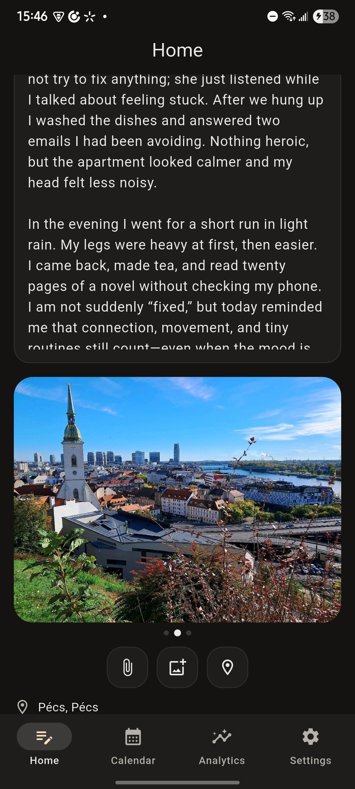
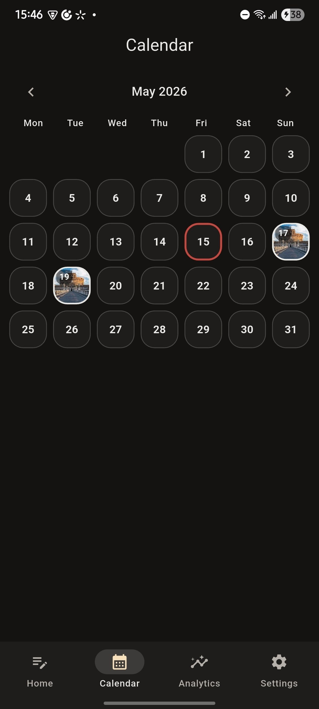
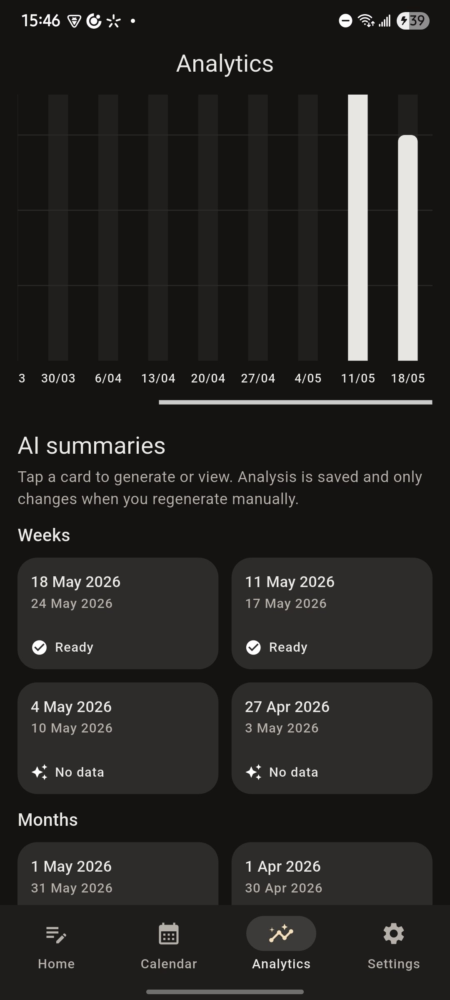
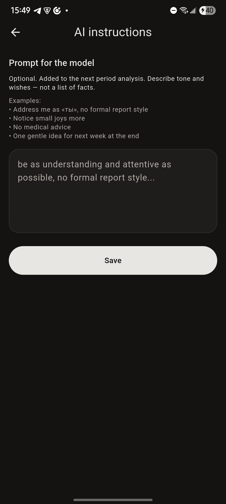

# Me Mine

A Flutter personal journal focused on daily reflection, offline-first entry editing, mood analytics, private attachments,server-side AI period summaries and clear separation between UI, state, repositories, and services


## Demo

[Watch demo on YouTube](https://youtube.com/shorts/8Etaq4D1LnI?feature=share)

## Screenshots

| Home | Calendar |
|:---:|:---:|
|  |  |

| Analytics | AI summary |
|:---:|:---:|
|  |  |

## What It Does

The app offers users the experience of a traditional journal, but in a new, more modern, and user-friendly format. It allows users to make entries and attach details about what happened to them that day, such as photos, geolocation, music, and more. You can then review and track your emotional patterns and changes through the calendar and AI-generated features. You can fine-tune the AI’s behavior and tone of response yourself

- Daily entry with text, 1–5 mood rating, photos, files, location and music
- Calendar view with visual highlights for entries and attachments
- AI period summaries and mood analytics generated from real entries and saved per user
- Optional reminders, passcode, bio,etric unlock etc

## Engineering Highlights

- Local-first entry flow: journal data is written to SQLite first, then synchronized with Firestore in the background
- Separation of Concerns: UI doesn’t talk directrly; screens use Riverpod providers and repositories
- Server-side AI: Gemini is called exclusively from Firebase Cloud Functions, so the API key never makes its way into the app
- Media optimization: photos are compressed locally before upload to reduce storage cost and improve upload speed
- Data model: entries, attachments and AI summaries are stored under the authenticated user
- Privacy layer: optional PIN/biometric lock with passcode hash stored in secure storage
- Navigation: Centralized by GoRouter, route redirects react to auth and onboarding state, so screens are not manually guarded in every widget

## Architecture

The app follows a feature-first structure with shared core modules:

```text
lib/
  core/        theme, routing helpers, formatting, navigation keys
  features/    auth, home, calendar, analytics, security, settings
  models/      serializable domain models
  shared/      reusable UI and attachment components
functions/     Firebase Cloud Functions for AI analysis
```

Main data flow:

```text
Flutter UI
  -> Riverpod providers
  -> Repository / service layer
  -> Local SQLite store
  -> Firebase Auth / Firestore / Storage / Functions
```

## Why This Stack

- **Riverpod** I knew from the start that the app would involve a lot of live data and various dependencies, so I used Riverpod early on to keep the UI and business logic separate. This made the dependencies clear, saved me from writing unnecessary code, and allowed me to reuse the same logic across different screens.
- **GoRouter** It's simple: the goal was to specify specific rules for transitioning from one screen to another depending on the circumstances, while keeping everything in one place
- **Firebase** I used it because it's the simplest and safest way to implement Auth, Firestore, Storage, and Functions without having to maintain a custom backend
- **SQLite** At first, I used Shared Preferences, but then I needed to retrieve records based on a date range and sync_status, so I quickly switched to this solution
- **CloudFunction** I did this so that the AI API key would be stored as a Firebase Secret rather than within the app, and for the sake of flexibility, because this allows me to limit the frequency of key generation, centralize business logic on the server, and so on.

## Security & Privacy

- Gemini API key is stored as a Firebase Functions secret and is never included in the Flutter client.
- Firebase Auth is used to scope user data under `users/{uid}`.
- Journal entries, attachments, and AI summaries are stored per authenticated user.
- Optional app passcode is stored as a SHA-256 hash in secure storage, not as plaintext.
- Firebase client config files are included intentionally; production API keys should be restricted in Google Cloud.


